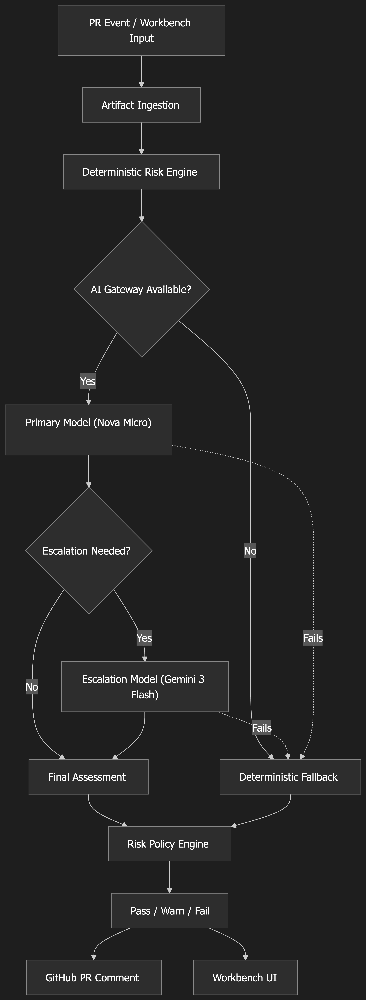

# Release Guard

Release Guard is a Next.js demo for assessing release risk from PR diffs, Terraform plans, change tickets, release notes, and config changes.

The app is built around a cheap-first review path:

- A deterministic heuristic engine parses and scores the artifact first.
- A low-cost model performs the first structured review.
- The review auto-escalates to a stronger model when the first pass is uncertain.
- If model access is unavailable or the model path fails, the deterministic baseline becomes the final fallback.

The same review pipeline powers both the interactive workbench and the GitHub-oriented PR risk endpoint.

## Usage

1. Start the app with `pnpm dev`.
2. Paste a PR diff, Terraform plan, change ticket, release note, or config change into the workbench.
3. Pick one of the demo scenarios if you want a guided example.
4. Review the deterministic baseline, model escalation, fallback path, and final gate decision.
5. Use the `/api/analyze` endpoint for the interactive workflow or `/api/github/risk` for PR gating.

## What The App Does

- Single-page analyst workbench with one primary artifact input and a lightweight refinement panel.
- Four curated demo scenarios in the UI.
- Final structured review with:
  - risk level
  - confidence
  - expected scope
  - missing information
  - rollback considerations
  - recommended action
  - executive summary
- Visible review trail showing whether the run stayed on the cheap path, escalated, fell back, or was policy-exempt.
- Lightweight tool calls for change checklists and service runbooks.
- Simulated GitHub PR comment preview in the UI.
- JSON API for GitHub or CI-based PR gating.
- Repo-local grounding pack in `.changeRisk/` for taxonomy, examples, and non-runtime path policy.

## Current Architecture

- `app/page.tsx` renders a single `ChangeRiskWorkbench`.
- `components/change-risk-workbench.tsx` owns the artifact form, demo scenarios, review-path UI, deterministic guardrail panel, and GitHub preview tab.
- `app/api/analyze/route.ts` accepts workbench-style requests, fixtures, or PR-style payloads and streams back the final report plus structured review data.
- `lib/review.ts` orchestrates the review pipeline:
  - deterministic baseline
  - primary model review
  - escalation review when needed
  - deterministic fallback on failure
- `lib/model.ts` configures the primary and escalation AI Gateway models.
- `lib/github-risk.ts` reuses the same review logic for PR-style payloads and applies gate policy.
- `app/api/github/risk/route.ts` exposes the PR risk JSON endpoint.
- `proxy.ts` applies optional Basic Auth to the demo while leaving the PR risk API outside that gate.
- `lib/repo-grounding.ts` and `lib/repo-risk-policy.ts` load repo-local calibration and exemption rules from `.changeRisk/`.

## Repo Structure

```text
app/
  api/analyze/route.ts
  api/github/risk/route.ts
  globals.css
  layout.tsx
  page.tsx
components/
  change-risk-workbench.tsx
proxy.ts
.changeRisk/
  README.md
  policy.yaml
  project.md
  risk-taxonomy.md
  examples/
lib/
  analysis-ui-message.ts
  artifact-ingestion.ts
  change-tools.ts
  demo-scenarios.ts
  fixtures.ts
  github-comment.ts
  github-risk.ts
  model.ts
  prompt.ts
  repo-grounding.ts
  repo-risk-policy.ts
  report.ts
  request-auth.ts
  review.ts
  risk-engine.ts
  risk-policy.ts
  types.ts
  ui-stream.ts
scripts/
  build-pr-risk-payload.ts
  eval.ts
  pr-risk.ts
data/
  change-risk-copilot-dataset.json
```

## Review Flow



1. The UI or API submits a change artifact.
2. `lib/artifact-ingestion.ts` extracts a normalized `ChangeRequest`.
3. `lib/risk-engine.ts` produces a deterministic baseline assessment.
4. If AI Gateway is available, the primary model runs first.
5. If the first review is uncertain, `lib/review.ts` escalates to the configured stronger model.
6. Tool calls may fetch a change checklist or a lightweight runbook.
7. `lib/risk-policy.ts` converts the final review into a gate decision for PR workflows.
8. If model access is unavailable or unusable, the deterministic baseline becomes the final answer.

## Setup

```bash
pnpm install
cp .env.example .env.local
pnpm dev
```

Local model access requires `AI_GATEWAY_API_KEY`.

Required model configuration:

- `RISK_PRIMARY_MODEL`
- `RISK_ESCALATION_MODEL`

Other environment variables:

- `DEMO_USERNAME`
- `DEMO_PASSWORD`
- `RISK_API_KEY`

If no gateway credentials are available, the app still works in deterministic fallback mode.

## Demo Deployment Setup

Use Vercel Deployment Protection for the deployment itself, Vercel's automation bypass for GitHub Actions, and two app-level secrets for the demo.

Vercel environment variables:

- `AI_GATEWAY_API_KEY`
- `DEMO_USERNAME=demo`
- `DEMO_PASSWORD=<short random password>`
- `RISK_API_KEY=<separate random token for GitHub Actions>`
- `RISK_PRIMARY_MODEL`
- `RISK_ESCALATION_MODEL`

GitHub Actions secrets:

- `RISK_ENDPOINT_URL`
- `VERCEL_AUTOMATION_BYPASS_SECRET`
- `RISK_API_KEY`
  - Must match the Vercel `RISK_API_KEY`

Recommended setup:

1. Import the GitHub repo into Vercel.
2. Add the Vercel environment variables above.
3. Enable Deployment Protection for the deployment you will share.
4. Create the Vercel automation bypass secret.
5. Deploy once and set `RISK_ENDPOINT_URL=https://<deployment-url>/api/github/risk` in GitHub.
6. Re-run the PR workflow and confirm it can post the sticky PR comment.

Result:

- Visiting the demo URL prompts for HTTP Basic Auth using `DEMO_USERNAME` and `DEMO_PASSWORD`.
- GitHub Actions calls `/api/github/risk` with both the Vercel bypass header and `Authorization: Bearer <RISK_API_KEY>`.

## Commands

```bash
pnpm dev
pnpm build
pnpm lint
pnpm typecheck
pnpm eval
pnpm eval --models-only
pnpm eval --baseline-only
pnpm eval --all-model-fixtures
pnpm risk:pr
pnpm check
```

Recommended usage:

- `pnpm eval` is the best demo command. It shows the 12-fixture deterministic baseline suite first, then a live model-path smoke test with primary, escalation, and final model/source reporting.
- `pnpm eval --models-only` is the fastest demo when you want to focus on the cheap-first model story and the live review trail.
- `pnpm eval --baseline-only` is the deterministic safety-floor suite only. This is what `pnpm check` uses so CI stays stable and cheap.
- `pnpm eval --all-model-fixtures` runs the live model path across all 12 fixtures. It is slower and more expensive, so it is better for a deeper calibration pass than a short terminal demo.

`pnpm check` runs typecheck, lint, and `pnpm eval --baseline-only`.

## Eval Coverage

The eval runner now has two layers:

- Deterministic baseline: 12 synthetic fixtures across low, medium, high, and unknown tiers, with 5 checks per fixture.
- Live model smoke: a smaller fixture set by default, using the real primary model, escalation path, and final source reporting. This section streams progress live in the terminal.

The deterministic baseline checks:

- expected risk level
- blast-radius keywords
- minimum clarifying-question count
- rollback guidance presence
- explicit unknown handling for ambiguous cases

The default live model smoke uses four featured fixtures, one per tier. Pass `--all-model-fixtures` if you want the live model path across the full synthetic set.

The interactive workbench only exposes four demo scenarios, but the deterministic fixture set is broader.

## APIs

### `POST /api/analyze`

Accepts chat messages, a partial normalized request, a fixture id, and/or a `github` payload for PR-style review. The route streams:

- progress updates for primary, escalation, fallback, and completion states
- structured review result data
- the final readable report text

### `POST /api/github/risk`

Accepts PR-style JSON:

```json
{
  "title": "Tighten inbound rules for production app subnet",
  "body": "Restrict ingress to approved load balancers and bastion hosts.",
  "baseRef": "main",
  "headRef": "feature/security-group-change",
  "diff": "diff --git a/infra/main.tf b/infra/main.tf\n..."
}
```

Response fields include:

- `decision`
- `assessment`
- `initialAssessment`
- `baselineAssessment`
- `trail`
- `request`
- `toolActivity`
- `commentBody`

If all changed files match repo-defined non-runtime paths or extensions, the PR can take the `policy-exempt` path without invoking the operational review flow.

## GitHub Automation

The repo includes a sample workflow at `.github/workflows/pr-risk.yml`.

That workflow runs `pnpm check`, builds a PR payload with `scripts/build-pr-risk-payload.ts`, calls the deployed `/api/github/risk` endpoint, posts or updates a sticky PR comment, and fails the job when the returned decision status is `fail`.

The intended deployment story is a protected Vercel preview endpoint plus the Vercel automation bypass secret for GitHub Actions.

The workflow now also sends `Authorization: Bearer $RISK_API_KEY` so the deployed PR-risk route has a narrow machine credential in addition to Vercel's deployment-level bypass.

## Repo Grounding

`.changeRisk/` is optional but supported by the live code.

- `project.md` describes repo-specific scope and sensitive areas.
- `risk-taxonomy.md` calibrates what low, medium, high, and unknown mean for this repo.
- `policy.yaml` defines non-runtime exemptions and related policy inputs.
- `examples/` provides repo-native calibration examples for the model prompt.

## Runtime Choice

The API routes use the default Node.js runtime, not the Vercel Edge Runtime. This is a deliberate choice: `lib/repo-grounding.ts` and `lib/repo-risk-policy.ts` use `node:fs` to read the `.changeRisk/` grounding pack from the deployed filesystem. Edge Runtime does not support `node:fs`, so Edge would require moving repo grounding to a database or KV store — unnecessary complexity for a repo-local policy model.

Features like ISR and Edge Middleware are not used because every review request is unique (no cacheable responses) and authentication is handled at the route level via Basic Auth and Bearer tokens rather than middleware.

## Notes

- The visible grade in the UI is the final review, not the deterministic baseline.
- The deterministic engine remains important for fallback behavior, evals, and provenance.
- The app is intentionally single-session and does not include persistence or a database.
